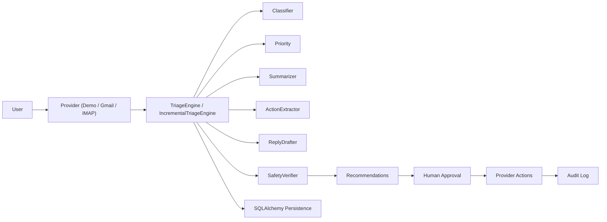

# InboxAnchor

InboxAnchor is a safety-first inbox triage system for overloaded email accounts. It classifies, prioritizes, summarizes, drafts, and recommends cleanup actions while keeping a human in the loop for anything risky. The project is intentionally opinionated: it is not an auto-delete bot, and it treats approval, auditability, and rollback-friendly behavior as product features, not afterthoughts.

## What It Does

- Connects to demo, Gmail, and IMAP-family provider paths through a shared provider abstraction
- Classifies unread mail into actionable categories such as work, finance, promo, newsletter, personal, and opportunity
- Scores priority and surfaces urgent reply pressure
- Extracts action items and drafts suggested replies
- Recommends cleanup actions such as mark-as-read, archive, trash, and label application
- Runs a safety verifier before any mailbox action is executed
- Separates recommendations into safe, requires-approval, and blocked lanes
- Persists triage runs, recommendations, audit history, provider state, and workspace settings
- Supports bulk lane actions, operator playbooks, focus views, and follow-up radar in the dashboard
- Exposes a FastAPI backend and a Streamlit workspace on top of the same core engine

## Architecture



### Repository Layout

```text
inboxanchor/
  agents/         LLM-backed classifiers, extractors, summarizers, drafters, and safety logic
  api/            FastAPI entrypoints plus auth, oauth, and webhook routers
  app/            Streamlit workspace and visual system
  bootstrap.py    Service construction, provider profiles, provider wiring, and runtime defaults
  config/         Environment-backed settings
  connectors/     Demo provider, Gmail client/transport, IMAP client/transport, OAuth helpers
  core/           Triage engine, incremental triage wrapper, and rules engine
  infra/          Auth service, database ORM, repository, retry layer, LLM client/providers, audit log
  models/         Pydantic models for email, providers, policy, auth, and run results
tests/            Offline test suite for engine, auth, providers, API, dashboard helpers, and fallbacks
docs/             Gmail setup and internal engineering prompts
```

### Core Components

- `inboxanchor/agents/`
  LLM-backed task agents with heuristic fallback. OpenAI and Groq are supported through the shared provider layer.
- `inboxanchor/connectors/`
  Demo mailbox support, Gmail OAuth transport, and IMAP-family transport support.
- `inboxanchor/core/triage_engine.py`
  Main orchestration loop for classification, prioritization, extraction, drafting, recommendations, and persistence.
- `inboxanchor/core/incremental_triage.py`
  Checkpoint-aware wrapper for incremental runs.
- `inboxanchor/infra/auth.py`
  Account registration, password verification, session issuance, and logout.
- `inboxanchor/app/dashboard.py`
  Account-aware operations workspace with playbooks, focus inbox, approval center, and run explorer.

## Safety Design

InboxAnchor is built around conservative defaults.

- `dry_run=True` is the default behavior for triage runs.
- Trash execution requires explicit confirmation at execution time.
- The safety verifier can downgrade or block risky recommendations before execution.
- Finance, personal, attachment-heavy, and other sensitive threads stay gated for review under default policy.
- Every executed action is written to the audit log.
- Suggested replies are drafts only. InboxAnchor does not send emails automatically.

## LLM Providers

The task agents use real LLM calls where it matters and fall back to heuristics when needed.

- Supported providers: `openai`, `groq`, and `mock`
- Provider selection: `INBOXANCHOR_LLM_PROVIDER`
- Typical OpenAI setup:

```bash
export INBOXANCHOR_LLM_PROVIDER=openai
export OPENAI_API_KEY=...
```

- Typical Groq setup:

```bash
export INBOXANCHOR_LLM_PROVIDER=groq
export GROQ_API_KEY=...
```

Without API keys, InboxAnchor safely falls back to the mock backend and heuristic behavior. That keeps the project offline-testable and demo-ready.

## Providers

| Provider | Status | Auth Method | Notes |
| --- | --- | --- | --- |
| Demo / Fake | Ready | None | Best for testing, demos, and seeded 10K-style runs |
| Gmail | Configurable | OAuth 2.0 | Uses preview-safe fallback until credentials and connection state are configured |
| Generic IMAP | Configurable | Password or app password | Uses live IMAP transport when env vars are set |
| Yahoo Mail | Planned via IMAP path | App password | Uses the IMAP-family provider route |
| Outlook | Planned via IMAP path | App password or future OAuth | Uses the IMAP-family provider route today |

## Setup

### Quick Start (Demo Mode)

```bash
git clone https://github.com/lucaomul/InboxAnchor.git
cd InboxAnchor
python3 -m venv .venv
source .venv/bin/activate
pip install -r requirements.txt
cp .env.example .env
make dashboard
```

Demo mode uses seeded inbox data. No mailbox connection or API keys are required.

### With LLM (OpenAI)

Add to `.env`:

```bash
INBOXANCHOR_LLM_PROVIDER=openai
OPENAI_API_KEY=your_key_here
```

### With LLM (Groq)

Add to `.env`:

```bash
INBOXANCHOR_LLM_PROVIDER=groq
GROQ_API_KEY=your_key_here
```

### With Gmail (Live)

See [docs/gmail_setup.md](docs/gmail_setup.md).

At minimum you will need:

- `GMAIL_CREDENTIALS_PATH`
- optional `GMAIL_TOKEN_PATH`
- a provider connection state that marks Gmail as configured or connected

If Gmail is not configured, InboxAnchor falls back to a safe preview provider for Gmail-mode testing.

### With IMAP

Set:

```bash
IMAP_HOST=imap.example.com
IMAP_PORT=993
IMAP_USERNAME=you@example.com
IMAP_PASSWORD=your_app_password
```

Optional:

- `IMAP_USE_SSL=true`
- `IMAP_MAILBOX=INBOX`
- `IMAP_ARCHIVE_MAILBOX=Archive`
- `IMAP_TRASH_MAILBOX=Trash`

### Docker

```bash
docker compose up --build
```

- API: [http://localhost:8000](http://localhost:8000)
- Dashboard: [http://localhost:8501](http://localhost:8501)

## Authentication

The Streamlit workspace is account-aware and requires sign-in unless you intentionally use demo mode.

- passwords are hashed with `pbkdf2_sha256`
- iteration count: `240000`
- session tokens are stored as SHA-256 hashes, not raw tokens
- auth state is exposed through `/auth/*` endpoints and mirrored in the dashboard session state

## API

### Health and Provider State

- `GET /health` — basic service health and current provider
- `GET /emails/unread` — list unread emails from the active provider
- `GET /providers` — list provider profiles and connection state
- `GET /settings/workspace` — load saved workspace defaults
- `PUT /settings/workspace` — save workspace defaults and policy
- `GET /providers/{provider}/connection` — get stored provider connection state
- `PUT /providers/{provider}/connection` — save provider connection state

### Triage and Execution

- `POST /triage/run` — run triage with saved or explicit settings
- `GET /triage` — list recent triage runs
- `GET /triage/{run_id}` — fetch a stored run payload
- `GET /triage/{run_id}/emails` — paginated stored emails for a run
- `GET /triage/{run_id}/email-details` — stored email details plus classification filters
- `GET /triage/{run_id}/recommendations` — paginated stored recommendations
- `GET /triage/{run_id}/recommendation-details` — expanded stored recommendation records
- `POST /actions/approve` — queue emails for execution
- `POST /actions/reject` — remove queued emails from execution
- `POST /actions/execute` — execute approved actions
- `GET /audit` — list audit log entries

### Authentication

- `POST /auth/signup` — create an account and issue a session token
- `POST /auth/login` — authenticate and issue a session token
- `GET /auth/me` — inspect the current bearer token
- `POST /auth/logout` — revoke the current bearer token

### OAuth and Webhooks

- `GET /oauth/gmail/start` — generate a Gmail OAuth authorization URL
- `GET /oauth/gmail/callback` — complete Gmail OAuth and persist provider connection state
- `POST /webhooks/gmail` — accept Gmail push notifications and trigger triage

## Dashboard

The Streamlit workspace currently includes:

- account access with sign-in, sign-up, and demo mode
- operator playbooks for common workflows
- command center controls for provider, batch sizing, and preview caps
- inbox overview and category map
- approval center and decision lanes
- focus inbox split into reply pressure, approvals, sensitive mail, and cleanup
- follow-up radar for stale reply pressure
- action items and suggested replies
- workspace settings, policy studio, and provider setup
- run explorer and audit timeline

## Testing

```bash
make test
```

The test suite is offline and deterministic. It covers:

- auth service and auth routes
- triage engine and incremental triage
- safety verifier and rules engine
- LLM provider wrappers and heuristic fallback paths
- Gmail connector behavior
- IMAP transport behavior
- API routes
- dashboard helper logic
- audit logging and persistence

## Current Status

InboxAnchor is already strong for:

- product demos
- offline and mocked testing
- inbox policy experimentation
- approval and audit workflow validation
- large unread-inbox simulation

Still pending before calling it fully production-ready:

- battle-tested live mailbox onboarding across Gmail and IMAP-family providers
- deeper multi-user SaaS controls
- more mature shared inbox / assignment workflows
- broader deployment and secrets-management hardening

## Roadmap

- `v0.1` (current): triage engine, auth, Gmail/IMAP provider paths, LLM agents, FastAPI, Streamlit, audit log, playbooks, focus inbox, follow-up radar
- `v0.2`: draft-to-send workflow, richer reminder scheduling, label automation, better provider onboarding
- `v0.3`: Outlook Graph connector, team ownership flows, Slack/Notion export, deeper analytics
- `v1.0`: multi-user SaaS controls, billing, enterprise audit controls, hardened live-provider rollout

## Author

Luca Craciun — AI Automation Engineer

- GitHub: [github.com/lucaomul](https://github.com/lucaomul)
- LinkedIn: [linkedin.com/in/lucaomul](https://www.linkedin.com/in/lucaomul)
