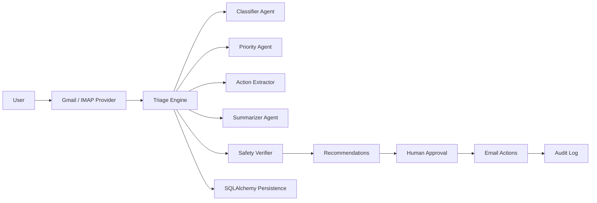

# InboxAnchor

**InboxAnchor** is a safety-first inbox operations system that helps overloaded professionals regain control of unread email without turning their mailbox into a risky auto-delete experiment.

It classifies, prioritizes, summarizes, and recommends inbox cleanup actions while keeping a human in the loop for anything risky.

## Project Status

InboxAnchor is an **active v1 work in progress**.

The current repo is already strong enough for:

- product demos
- offline testing
- policy and approval workflow validation
- large-inbox triage simulation

The following pieces are still pending before calling it production-ready:

- live Gmail OAuth transport
- hardened live IMAP-family transports for Yahoo / Outlook / generic inboxes
- deeper SaaS account, auth, and team features
- more production deployment polish

For now, non-demo providers run in a **safe preview mode** so the UX, triage, policy, and audit flows can be tested without touching a real mailbox.

## Value Proposition

**An AI-powered inbox operations agent that safely classifies, prioritizes, summarizes, and cleans up overloaded inboxes with human-in-the-loop approval.**

## Why It Exists

People with thousands of unread emails do not need another toy assistant that says "good luck."

They need a system that can:

- separate signal from noise
- surface what matters first
- extract real follow-up work
- recommend cleanup safely
- preserve trust with auditability and approval gates

InboxAnchor is built around that principle.

## Safety-First Design

InboxAnchor is intentionally conservative.

- It defaults to **recommend first, act second**.
- `POST /triage/run` defaults to `dry_run=true`.
- Destructive actions never happen silently.
- Moving mail to trash requires explicit confirmation.
- Emails with attachments require review.
- High-priority, finance, work, personal, opportunity, and urgent mail are never treated as easy cleanup candidates.
- Every executed action is written to an audit log.

This is not an auto-delete bot.

## What It Does

- Fetches unread emails from a provider abstraction
- Classifies messages into useful inbox categories
- Ranks priority and highlights the top queue
- Extracts actionable follow-ups
- Suggests draft replies without sending them
- Recommends cleanup actions such as mark-as-read, archive, or trash
- Runs a safety verifier before any action is executed
- Persists triage runs, email metadata, recommendations, and audit logs
- Exposes both a FastAPI backend and a Streamlit dashboard

## Architecture



## Current Provider Story

### Gmail

`inboxanchor/connectors/gmail_client.py` is built as an **OAuth-ready Gmail connector surface** with a pluggable transport.

That means:

- the connector contract is stable
- tests stay fully mocked
- production Gmail API wiring can be added without changing the triage engine
- live setup instructions now live in `docs/gmail_setup.md`

### IMAP / Yahoo / Outlook-Style Providers

InboxAnchor also includes an IMAP-oriented provider surface in `inboxanchor/connectors/imap_client.py`.

That gives the project a clean path toward:

- Yahoo Mail
- Outlook / Microsoft-hosted IMAP inboxes
- other generic IMAP-compatible mailboxes

V1 keeps this implementation intentionally thin and safe while the engine, rules, API, and UI mature around it.

## Productionization Status

InboxAnchor now includes:

- a real Gmail OAuth transport path
- a real IMAP transport path
- retry and timeout handling for LLM calls
- incremental triage checkpoint support
- optional Gmail webhook scaffolding for push-triggered incremental triage

Still pending before full production rollout:

- battle-tested live provider onboarding UX
- deployment-grade secret management and SaaS auth
- deeper provider-specific hardening for every mailbox family

## Core Components

### Connectors

- `gmail_client.py`
- `imap_client.py`
- `fake_provider.py`

### Agents

- `classifier.py`
- `priority_agent.py`
- `summarizer.py`
- `action_extractor.py`
- `reply_drafter.py`
- `safety_verifier.py`

### Core

- `rules.py`
- `triage_engine.py`

### Infra

- `llm_client.py`
- `database.py`
- `repository.py`
- `audit_log.py`

### Product Surfaces

- FastAPI backend in `inboxanchor/api/main.py`
- Streamlit dashboard in `inboxanchor/app/dashboard.py`

## Human Approval Workflow

1. Fetch unread email
2. Classify and prioritize
3. Extract action items
4. Generate recommendations
5. Run safety verification
6. Return safe vs approval-required vs blocked actions
7. Approve specific actions
8. Execute only the approved subset
9. Write the audit trail

## API Endpoints

- `GET /health`
- `GET /emails/unread`
- `POST /triage/run`
- `GET /triage/{run_id}`
- `POST /actions/approve`
- `POST /actions/reject`
- `POST /actions/execute`
- `GET /audit`

## Dashboard Sections

The Streamlit app includes:

- Inbox Overview
- Unread Email Categories
- Priority Queue
- Recommended Actions
- Action Items
- Suggested Replies
- Audit Log

The UI separates:

- safe recommendations
- actions that require approval
- blocked actions

## Running Locally

```bash
cd InboxAnchor
python -m pip install -r requirements.txt
```

Run the API:

```bash
make api
```

Run the dashboard:

```bash
make dashboard
```

## Docker

Build and run both services:

```bash
docker compose up --build
```

API:

- [http://localhost:8000](http://localhost:8000)

Dashboard:

- [http://localhost:8501](http://localhost:8501)

## Testing

Lint:

```bash
make lint
```

Tests:

```bash
make test
```

The test suite is fully offline and covers:

- email classification schema
- rules engine behavior
- safety verifier
- triage engine
- Gmail connector mocked behavior
- audit log creation
- API health
- API dry-run triage
- approval flow
- destructive action blocking

## Roadmap

### v0.1

- Gmail unread triage
- category classification
- digest and summary
- recommendations
- approval workflow

### v0.2

- stronger reply drafting
- calendar / task extraction
- label automation
- recurring cleanup rules

### v0.3

- Outlook support
- team inboxes
- Slack / Notion export
- analytics

### v1.0

- SaaS dashboard
- multi-user auth
- billing
- enterprise-grade audit controls

## Current Limitations

- The Gmail connector is transport-ready but does not yet ship a fully wired live Gmail OAuth transport in this repo.
- The IMAP provider is intentionally conservative and currently serves as a clean extension point rather than a full production connector.
- Reply drafting is currently lightweight and safe, not deeply personalized.
- The LLM client is abstraction-first and mock-friendly; live provider wiring should be added carefully behind the same interface.

## Product Principle

InboxAnchor is not trying to be reckless.

It is a safe inbox operations system that helps users regain control of large unread inboxes while preserving trust, auditability, and human approval.
