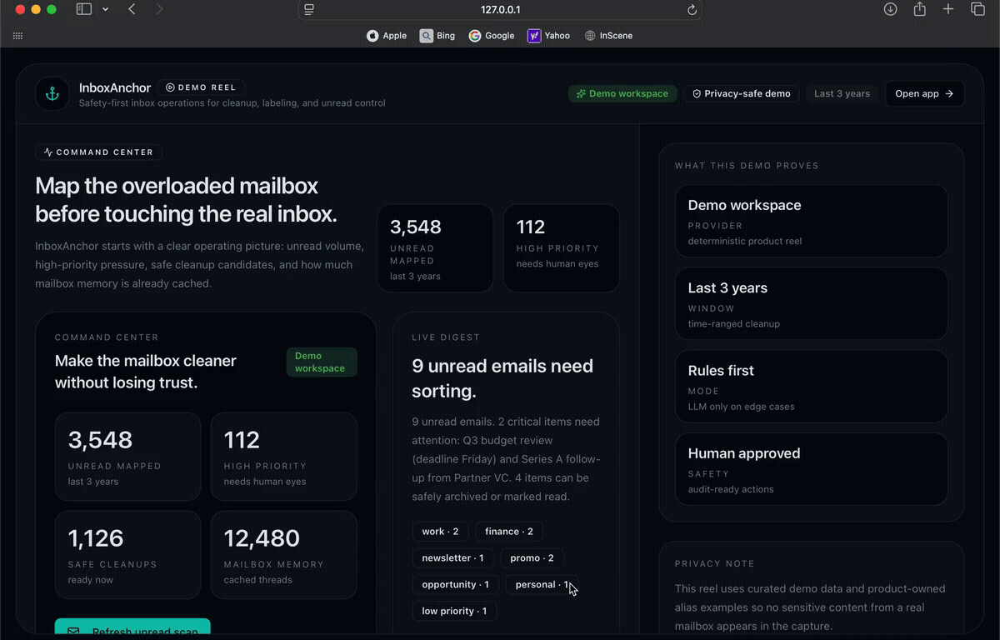
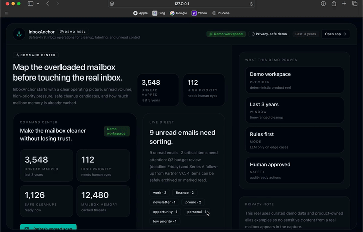
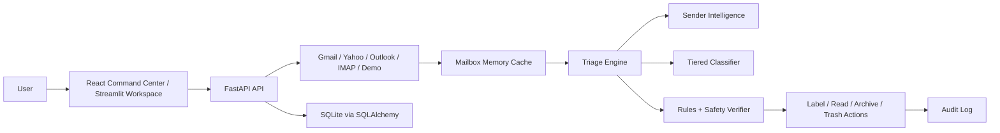

# InboxAnchor

InboxAnchor is a safety-first inbox operations system for people buried in email.

It connects to Gmail and IMAP-family inboxes, builds a local mailbox memory, classifies unread mail, recommends safe cleanup, applies one clean label per message, and keeps risky actions behind review. The project is intentionally opinionated: it is designed to make large inboxes calmer without turning into a blind auto-delete bot.

## Demo



The product demo shows the command center, unread scan, mailbox memory backfill, triage, cleanup workflows, and managed privacy aliases.

## Real Run



This capture shows InboxAnchor reading and organizing a real Gmail inbox, separate from the curated demo data.

## What InboxAnchor Does

- Connects to demo, Gmail, Yahoo, Outlook, and generic IMAP inboxes through a shared provider layer
- Builds a local mailbox memory so large inboxes can be explored without hammering the live provider every time
- Runs a tiered classifier:
  sender intelligence first, deterministic signal rules second, LLM fallback only for ambiguous mail
- Assigns exactly one visible InboxAnchor label per message
- Recommends safe actions like mark read, archive, cleanup, and review-needed lanes
- Keeps dangerous actions human-gated and writes executed actions to an audit log
- Supports background mailbox sync, incremental refresh, sender warmup, and lazy body hydration
- Exposes both a FastAPI backend and a React command center, with the older Streamlit workspace still available
- Supports privacy aliases and a managed-domain alias gateway path for addresses like `travel1234567@inboxanchor.com`

## What Makes It Different

InboxAnchor is not trying to be a generic email client.

It is built around three product ideas:

1. Safety over automation theater
   risky mail stays reviewable, approvals are explicit, and destructive actions are never the default

2. Industrial-scale inbox cleanup
   large unread sets and historical mail are handled in resumable background workflows instead of tiny one-off scans

3. Mailbox intelligence that compounds
   sender memory, cached classifications, incremental sync checkpoints, and mailbox history make later runs faster and smarter

## Current Highlights

- Single-label system:
  one visible InboxAnchor mailbox label per email
- Industrial unread scan:
  unlimited streaming for providers that support full unread iteration
- Historical mailbox memory:
  resumable, time-window aware, optional metadata-first backfill
- Sender warmup:
  populate sender intelligence before heavy classification
- Push notifications for Gmail:
  webhook path and watch registration support
- Per-user mailbox connections:
  app login is separated from provider mailbox ownership
- Yahoo / IMAP onboarding:
  app-password-based setup through the settings screen

## Architecture



## Provider Status

| Provider | Status | Auth | Notes |
| --- | --- | --- | --- |
| Demo / Fake | Ready | None | Best for demos, local testing, and offline workflows |
| Gmail | Strongest path | OAuth 2.0 | Best sync model, push notifications, live replies, richest provider support |
| Yahoo | Working via IMAP | App password | Slower than Gmail because the provider path is IMAP-based |
| Outlook | Working via IMAP | App password / IMAP credential | Same IMAP-family limits as Yahoo for now |
| Generic IMAP | Working | Password / app password | Good fallback for providers without a richer API |

## Quick Start

### 1. Clone and install

```bash
git clone https://github.com/lucaomul/InboxAnchor.git
cd InboxAnchor
python3 -m venv .venv
source .venv/bin/activate
pip install -r requirements.txt
cp .env.example .env
```

### 2. Run the backend

```bash
python -m uvicorn inboxanchor.api.main:app --reload --port 8010
```

### 3. Run the React frontend

```bash
cd frontend
npm install
npm run dev
```

Open the command center in the browser and point it at the backend URL.

### 4. Optional: run the Streamlit workspace

```bash
make dashboard
```

## Local Modes

### Demo mode

No mailbox connection or API keys required.

InboxAnchor can run entirely against seeded inbox data for product demos, testing, and UI work.

### Live Gmail

See [docs/gmail_setup.md](docs/gmail_setup.md).

At minimum you will need:

- `GMAIL_CLIENT_ID`
- `GMAIL_CLIENT_SECRET`
- `GMAIL_REDIRECT_URI`
- a configured Gmail provider connection in Settings

### Live Yahoo / IMAP

For Yahoo, use a Yahoo app password, not the normal Yahoo password.

Typical fields:

```bash
IMAP_HOST=imap.mail.yahoo.com
IMAP_PORT=993
IMAP_USERNAME=you@yahoo.com
IMAP_PASSWORD=your_app_password
IMAP_USE_SSL=true
IMAP_MAILBOX=INBOX
```

The app also supports entering these through Settings on a per-user basis.

## Recommended Flow For Large Inboxes

1. Connect the mailbox
2. Run `Fresh unread scan`
3. Run `Prepare unread decisions`
4. Run `Auto-label unread mail`
5. Run `Run safe cleanup`
6. Optionally run `Build mailbox memory` for deeper history

For very large mailboxes, Gmail is significantly faster than Yahoo/IMAP because Gmail exposes a better API surface.

## Managed Aliases

InboxAnchor treats clean privacy aliases as a product feature rather than just relying on plus-addressing.

Managed aliases require:

- `INBOXANCHOR_ALIAS_MANAGED_ENABLED=true`
- `INBOXANCHOR_ALIAS_DOMAIN=your-domain.com`
- `INBOXANCHOR_ALIAS_RESOLVER_SECRET=...`
- a reachable alias resolver endpoint

Cloudflare worker scaffold:

- `workers/alias-gateway/`

Backend resolve endpoint:

- `POST /aliases/resolve`

## Key API Endpoints

### Workspace and provider

- `GET /health`
- `GET /providers`
- `GET /providers/{provider}/connection`
- `PUT /providers/{provider}/connection`
- `GET /settings/workspace`
- `PUT /settings/workspace`

### Auth

- `POST /auth/signup`
- `POST /auth/login`
- `GET /auth/me`
- `POST /auth/logout`

### Mailbox operations

- `GET /ops/overview`
- `GET /ops/progress`
- `POST /ops/scan`
- `POST /ops/backfill`
- `POST /ops/classify-cache`
- `POST /ops/auto-label`
- `POST /ops/safe-cleanup`
- `POST /ops/full-anchor`
- `POST /ops/industrial-read`

### Triage and execution

- `POST /triage/run`
- `GET /triage`
- `GET /triage/{run_id}`
- `POST /actions/approve`
- `POST /actions/reject`
- `POST /actions/execute`
- `GET /audit`

### Gmail webhooks

- `POST /webhooks/gmail`
- `POST /ops/watch/start`
- `POST /ops/watch/stop`

## Repository Layout

```text
inboxanchor/
  agents/         LLM-backed and heuristic agents
  api/            FastAPI app and routers
  app/            Streamlit workspace
  config/         Environment-backed settings
  connectors/     Gmail, IMAP, demo provider, OAuth helpers, webhooks
  core/           Triage, incremental sync, sender warmup, rules, backfill
  infra/          SQLAlchemy models, repository, auth, audit, retry, LLM plumbing
  models/         Pydantic models
frontend/         React command center
tests/            Offline test suite
docs/             Setup notes and engineering docs
workers/          Alias gateway worker
```

## Testing

Run the offline test suite:

```bash
make test
```

The project is designed so core behavior remains testable without live provider access.

## Current Status

InboxAnchor is already strong for:

- product demos
- large unread inbox cleanup
- sender-aware mailbox classification
- historical mailbox caching
- safe action workflows
- Gmail-first production-style flows

Still improving:

- Yahoo / IMAP speed ceiling
- deeper SaaS-style multi-user isolation across every cache and analytics table
- broader provider-native capabilities beyond IMAP
- more mature alias deployment defaults

## Author

Luca Craciun — AI Automation Engineer

- GitHub: [github.com/lucaomul](https://github.com/lucaomul)
- LinkedIn: [linkedin.com/in/lucaomul](https://www.linkedin.com/in/lucaomul)
